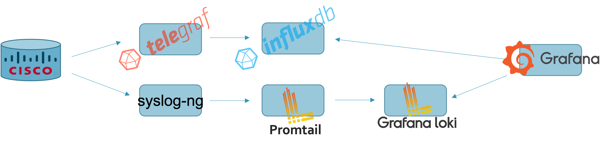

# Telegraf, IfluxDB, Grafana (TIG) Stack, w/ Loki

This is a simple containerized TIG stack that was initially part of a customer demonstration that I did around catching and visualizing Cisco IOS-XR MDT in Grafana.  In this repo I pulled out the TIG stack itself and have supplied it for customers to use in some of their own lab work.  Besides Telegraf, InfluxDB and Grafana, I've also included Loki (and Promtail) as an optional log data source to Grafana.  Additionally, because Promtail only works with RFC5424 syslog, it is somewhat limited by itself to catch RFC 3164 (514/udp) syslog that most network device management revolves around.

This is where syslog-ng comes into the picture.  As part of the Docker Compose process, a syslog-ng container will be built based upon the Dockerfile defined in `Dockerfile-syslog-ng`.  Its job is to catch UDP based syslog from e.g. cisco router and then turn around and pass that syslog on to Promtail via TCP port 1514.

The configuration files for Promtail, syslog-ng and Telegraf are local to the directory and overlay their respective locations found within `/etc` directories.  Other than that, Docker volumes are used for persistence where InfluxDB time-series and Grafana visualization is concerned.



## Configuration

Again, this was initially configured for use in a Cisco IOS-XR context, but with some minimal reconfiguration, you can take it in a lot of other directions.  For example, a quick Google and you will find many complimentary IOS-XE "how to" discussions.

Assuming some basic knowledge of Docker commands and the use of Docker Compose, the following files are presented within this repo:

```
.
├── .gitignore
├── Dockerfile-syslog-ng
├── LICENSE
├── README.md
├── configs
│   ├── promtail-config.yml
│   ├── syslog-ng.conf
│   └── telegraf.conf
├── docker-compose.yaml
└── tig-stack.png
```

### `./docker-compose.yaml`

There are quite a few comments included, in the file itself.  Beyond naming of networks, volumes and services themselves, the following could be considered for changing:

- Within the `influxdb:` service clause is the naming of the database to "test," as well as admin username/password set to "cisco/cisco."
- Within the `grafana:` service clause the admin username/password set to "cisco/cisco."
- Within the `telegraf` service clause, Telegraf should point to whatever the target database is in InfluxDB (in this case, "test").
- Addtionally, in this example MDT was assumed to be on port 57001, so that has to be exposed and matched to network device configurations.


### `./configs/telegraf.conf`

- Again, make sure username/password, database name and ports all match with other files, if anything is changed.
- Assumes the use of cisco_telemetry_mdt Telegraf plugin, in this example.
- Besides sending the telemetry data on to InfluxDB, also logs locally to a temporary file that can easily be `tail -f` to watch the raw telemetry come in.  Delete if not needed/wanted.

### `./configs/syslog-ng.conf`

- The configuration is set to filter all `local7` messages to `/var/log/cisco` and also send to Loki via Promtail.  All other `info` to `emerg` logged to default `/var/log/messages`.
- There is also some information prepended to the message as it comes in, with a "--" to divide the templated stamp from the original message and message header.
- Change as you see fit.

## Use

Once Docker Compose has spun up the containers, you can point your XR router's MDT configuration towards port 57001 of the Docker host, as well as syslog on port 514.

On Grafana, you can establish InfluxDB and Loki as data sources and start to build your dashboard around the now available metrics and messages.

**Note:** I may at a later date expand this detail to include some basics around how to do this, but for now my assumption is that there are numerous Grafana write-ups and examples on the web.  Those with a little play and exploration and you should be up in no time.

### Sample XR Configuration

To get you started, here are some example XR configurations that should work "as is" with this repo.  From a MDT perspective, some very basic sensor-path established.  Also, I filter the sensor-path to GigabitEthernet interfaces as an example.


The following assumes that at least Gig0/0/0/0 is "up/up" and the route to where the containerized TIG stack lives (change as required).  Also, replace `[[ docker-host ]]` with a resolvable name or IP address.

A good explanation of where the TPA (Third-Party App. address) can hang you up is available in Shelly Cadora's article [MDT with gRPC: Transport Tricks](https://xrdocs.io/telemetry/tutorials/2017-05-05-mdt-with-grpc-transport-tricks), found on [XRdocs.io](https://xrdocs.io).  In short, it has to do with the router's gRPC server using the underlying Linux networking stack, therefore a route to the TIG stack has to be available to the Linux kernel. 

```
!
!
tpa
 vrf default
  address-family ipv4
   update-source dataports GigabitEthernet0/0/0/0
  !
 !
!
telemetry model-driven
 destination-group DGROUP_1
  address-family ipv4 [[ docker-host ]] port 57001
   encoding self-describing-gpb
   protocol grpc no-tls
  !
 !
 sensor-group SGROUP_1
  !
  sensor-path Cisco-IOS-XR-infra-statsd-oper:infra-statistics/interfaces/interface[interface-name='GigabitEthernet*']/latest/generic-counters
  sensor-path Cisco-IOS-XR-infra-statsd-oper:infra-statistics/interfaces/interface[interface-name='GigabitEthernet*']/latest/data-rate
  !
  sensor-path Cisco-IOS-XR-shellutil-oper:system-time/uptime
  sensor-path Cisco-IOS-XR-wdsysmon-fd-oper:system-monitoring/cpu-utilization
  sensor-path Cisco-IOS-XR-nto-misc-oper:memory-summary/nodes/node/summary
  !
  sensor-path Cisco-IOS-XR-pfi-im-cmd-oper:interfaces/interfaces/interface[interface-name='GigabitEthernet*']
  !
 !
 subscription SUBSCRIPTION_1
  !
  ! in milliseconds
  !
  sensor-group-id SGROUP_1 sample-interval 5000
  destination-id DGROUP_1
 !
!
end
```

With regards to syslog:

```
logging [[ docker-host ]] vrf default
logging [[ docker-host ]] port 514
logging hostnameprefix [[ whatever-you-call-the-router ]]
logging facility local7
logging source-interface GigabitEthernet0/0/0/0
```